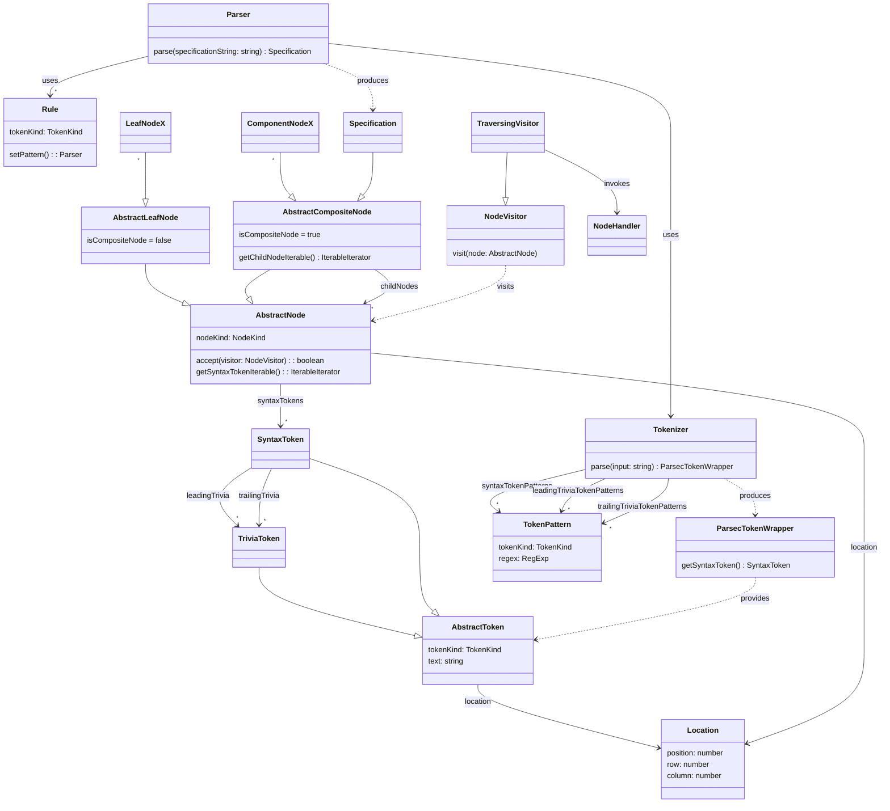

# mpeg-sdl-parser

> ISO/IEC 14496-34 Syntactic Description Language (MPEG SDL) parser implemented
> in TypeScript

[](https://github.com/flowscripter/mpeg-sdl-parser/releases)
[](https://github.com/flowscripter/mpeg-sdl-parser/actions/workflows/release-bun-library.yml)
[](https://codecov.io/gh/flowscripter/mpeg-sdl-parser)
[](https://flowscripter.github.io/mpeg-sdl-parser/index.html)
[](https://github.com/flowscripter/mpeg-sdl-parser/blob/main/LICENSE)

## TODO

- implement pretty printer
- support robust parsing e.g. skipped token and missing token reporting
- implement semantic checks e.g. referencing undefined identifiers
- implement undefined behaviour checks e.g. accessing an uninitialised value
- implement runtime correctness checks e.g. number limits
- support versioned SDL grammars and extensions

## CLI

A CLI tool using this module is available at
https://github.com/flowscripter/mpeg-sdl-tool

## Bun Module Usage

Add the module:

`bun add @flowscripter/mpeg-sdl-parser`

```typescript
import * as mpeg_sdl_parser from "@flowscripter/mpeg-sdl-parser";

const parser = new Parser();

// Parse SDL and produce an abstract syntax tree (AST)

const ast = parser.parse("computed int i;");

console.log(JSON.stringify(ast));

// Traverse the AST

class MyNodeHandler implements NodeHandler {
  beforeVisit(node: AbstractCompositeNode) {
    console.log("About to visit child nodes");
  }

  visit(node: AbstractLeafNode) {
    console.log("Visiting leaf node");
  }

  afterVisit(node: AbstractCompositeNode) {
    console.log("Finished visiting child nodes");
  }
}

const myNodeHandler = new MyNodeHandler();

dispatch(ast, myNodeHandler);
```

## Development

Install dependencies:

`bun install`

Test:

`bun test`

**NOTE**: The following tasks use Deno as it excels at these and Bun does not
currently provide such functionality:

Format:

`deno fmt`

Lint:

`deno lint index.ts src/ tests/`

Generate HTML API Documentation:

`deno doc --html --name=mpeg-sdl-parser index.ts`

## Documentation

### Overview

The parser is implemented using Microsoft's Typescript based parser combinator
library [ts-parsec](https://github.com/microsoft/ts-parsec).

Tokenization and parsing rules are developed referencing the SDL EBNF stored in
this repository: [grammar.txt](grammar.txt)

Parsing an SDL definition results in an abstract syntax tree output which can
then be used for further processing in consuming applications.



### API

Link to auto-generated API docs:

[API Documentation](https://flowscripter.github.io/mpeg-sdl-parser/~/Parser.html)

### Debug Logging

Internal framework logging can be enabled by setting the `MPEG_SDL_PARSER_DEBUG`
environment variable.

The logging implementation will look for an object conforming to the `Logger`
interface and use it if found. If not found, a simple logging implementation
using the `console` object will be used.

## License

MIT © Flowscripter
