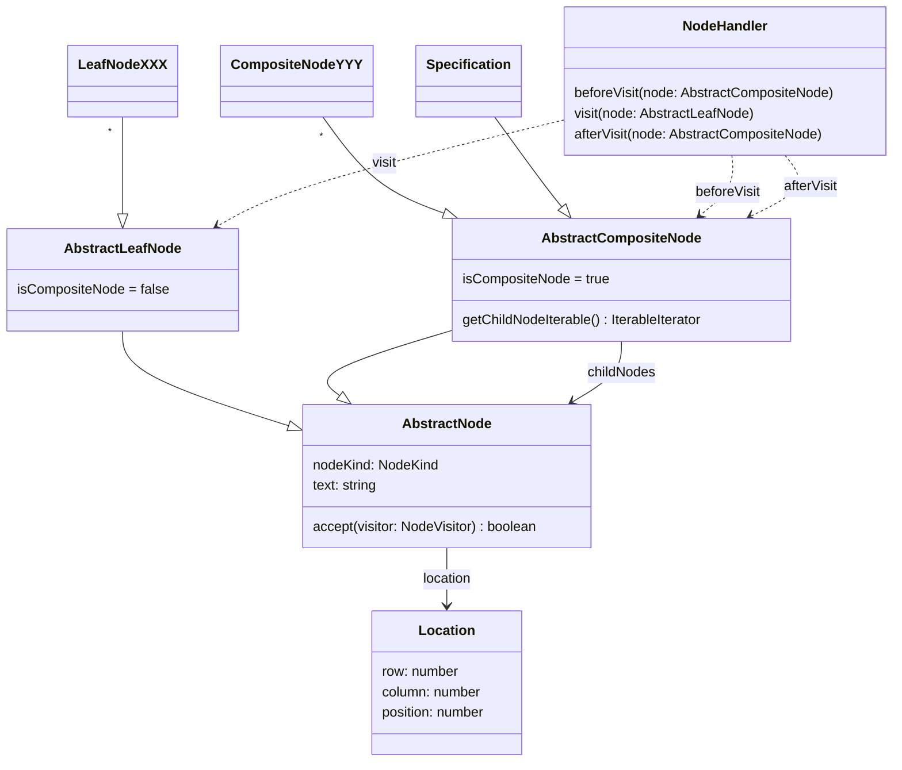

# mpeg-sdl-parser

> ISO/IEC 14496-34 Syntactic Description Language (MPEG SDL) parser implemented
> in TypeScript

[](https://github.com/flowscripter/mpeg-sdl-parser/releases)
[](https://github.com/flowscripter/mpeg-sdl-parser/actions/workflows/release-bun-library.yml)
[](https://codecov.io/gh/flowscripter/mpeg-sdl-parser)
[](https://flowscripter.github.io/mpeg-sdl-parser/index.html)
[](https://github.com/flowscripter/mpeg-sdl-parser/blob/main/LICENSE)

## CLI

A CLI tool using this module is available at
https://github.com/flowscripter/mpeg-sdl-tool

## Web Editor

A browser based web editor using this module is available at
https://github.com/flowscripter/mpeg-sdl-editor

## Bun Module Usage

Add the module:

`bun add @flowscripter/mpeg-sdl-parser`

```javascript
import {
  SdlStringInput,
  createLenientSdlParser,
  collateParseErrors,
  buildAst,
  dispatchNodeHandler,
  prettyPrint
} from "@flowscripter/mpeg-sdl-parser";

// Create a Lezer based SDL parser
// This will create a lenient parser which recovers from parse errors and places error nodes in the parse tree.
// A strict parser which will throw SyntacticParseError can be created with createStrictSdlParser().
const parser = await createLenientSdlParser();

// Prepare the SDL input
const sdlStringInput = new SdlStringInput("computed int i;");

// Parse SDL input and produce a parse tree
const sdlParseTree = sdlParser.parse(sdlStringInput);

// Traverse and print the parse tree
let cursor = sdlParseTree.cursor();
do {
  console.log(`Node ${cursor.name} from ${cursor.from} to ${cursor.to}`)
} while (cursor.next());

// Print any parsing errors by collating any error nodes in the parse tree
const parseErrors = collateParseErrors(sdlParseTree, sdlStringInput);

console.log(JSON.stringify(parseErrors);

// Build an Abstract Syntax Tree (AST) of the SDL specification from the parse tree
// Note that this will throw a SyntacticParseError if the parse tree contains parsing errors.
const specification = buildAst(sdlParseTree, sdlStringInput);

// Define a simple AST Node handler
class MyNodeHandler implements NodeHandler {
  beforeVisit(node: AbstractCompositeNode) {
    console.log("About to visit child nodes");
  }

  visit(node: AbstractLeafNode) {
    console.log("Visiting leaf node");
  }

  afterVisit(node: AbstractCompositeNode) {
    console.log("Finished visiting child nodes");
  }
}

// Dispatch the handler to visit all nodes in the AST
dispatchNodeHandler(specification, new MyNodeHandler());

// Pretty print the specification (retaining comments)
let prettifiedSpecification = await prettyPrint(specification, sdlStringInput)

console.log(prettifiedSpecification);

// A Prettier (prettier.io) plugin for SDL is also available:
import * as prettier from "prettier/standalone.js";
import { prettierPluginSdl } from "@flowscripter/mpeg-sdl-parser"; 

prettifiedSpecification = await prettier.format("computed int i;", { 
  parser: "sdl",
  plugins: [prettierPluginSdl],
});

console.log(prettifiedSpecification);
```

## Development

Install dependencies:

`bun install`

Test:

`bun test`

**NOTE**: The following tasks use Deno as it excels at these and Bun does not
currently provide such functionality:

Format:

`deno fmt`

Lint:

`deno lint index.ts src/ tests/`

Generate HTML API Documentation:

`deno doc --html --name=mpeg-sdl-parser index.ts`

## Documentation

### Overview

The parser is implemented using [Lezer](https://lezer.codemirror.net) using the
Lezer grammar defined in [sdl.lezer.grammar](grammar/sdl.lezer.grammar).

For reference purposes an SDL EBNF grammar is also provided in
[sdl.ebnf.grammar](grammar/sdl.ebnf.grammar)

### Abstract Syntax Tree Model



### API

Link to auto-generated API docs:

[API Documentation](https://flowscripter.github.io/mpeg-sdl-parser/~/Parser.html)

### Debug Logging

Internal framework logging can be enabled by setting the `MPEG_SDL_PARSER_DEBUG`
environment variable.

The logging implementation will look for an object conforming to the `Logger`
interface and use it if found. If not found, a simple logging implementation
using the `console` object will be used.

## License

MIT © Flowscripter
