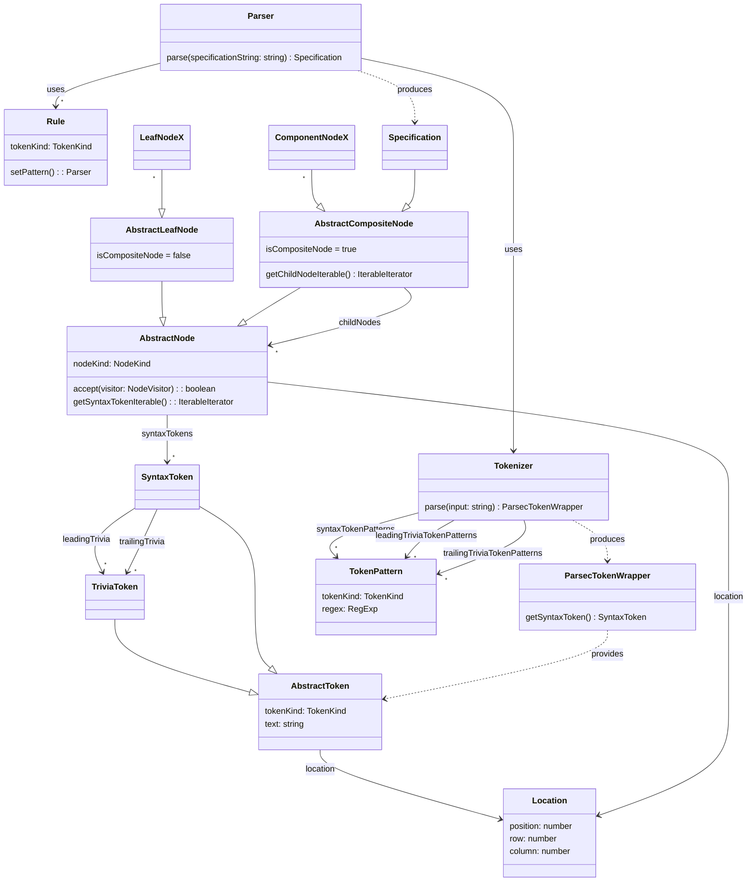

# mpeg-sdl-parser

> ISO/IEC 14496-34 Syntactic Description Language (MPEG SDL) parser implemented
> in TypeScript

**NOTE: Under development**

- fix GitHub workflows
- implement control flow parsing: `switch`, `while`
- provide separate CLI module:
  - test library module exports
  - implement pretty printer
  - implement syntax highlighter
- update this readme with:
  - link to CLI
- implement semantic checks

## Development

Install [Deno](https://docs.deno.com/runtime/getting_started/installation/)

Lint: `deno fmt`

Test: `deno test -A`

## Usage

```typescript
import * as mpeg_sdl_parser from "@flowscripter/mpeg-sdl-parser";

const parser = new Parser();

// Parse SDL and produce an AST (abstract syntax tree)

const ast = parser.parse("computed int i;");

console.log(JSON.stringify(ast));

class MyNodeVisitor implements NodeVisitor {
  visitBefore(node: AbstractNode): boolean {
    return true;
  }

  visitAfter(_node: AbstractNode): boolean {
    return true;
  }
}

const myNodeVisitor = new MyNodeVisitor();
const traversingVisitor = new TraversingVisitor(myNodeVisitor);

// Traverse the AST

ast.accept(traversingVisitor);
```

## Documentation

### Overview

The parser is implemented using Microsoft's Typescript based parser combinator
library [ts-parsec](https://github.com/microsoft/ts-parsec).

Tokenization and parsing rules are developed referencing the SDL EBNF stored in
this repository: [grammar.txt](grammar.txt)

Parsing an SDL definition results in an abstract syntax tree output which can
then be used for further processing in consuming applications.



### API

Link to auto-generated API docs for the library:

[API Documentation](https://jsr.io/@flowscripter/mpeg-sdl-parser/doc)

### Debug Logging

Internal framework logging can be enabled by setting the `MPEG_SDL_PARSER_DEBUG`
environment variable. (Permission will need to be granted to the CLI to access
the environment to look for this environment variable i.e. `--allow-env`.)

The `logger` implementation will detect this and define a default Deno
`ConsoleHandler` logger with `DEBUG` level which is used by internal
implementation classes such as the `parser` and `tokenizer`.

## License

MIT © Flowscripter
