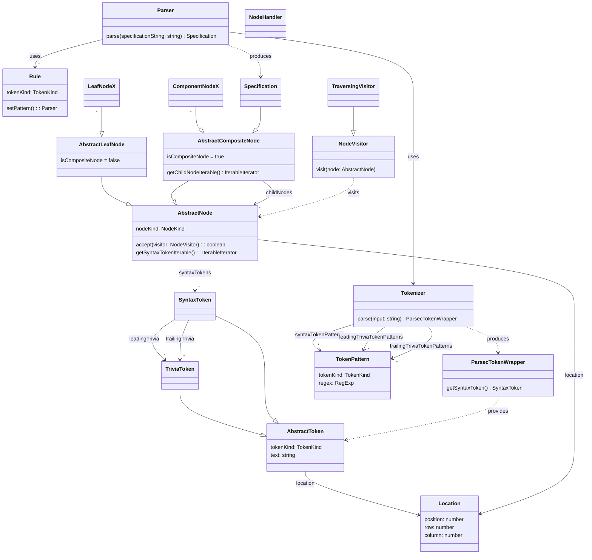

# mpeg-sdl-parser

> ISO/IEC 14496-34 Syntactic Description Language (MPEG SDL) parser implemented
> in TypeScript

[](https://github.com/flowscripter/mpeg-sdl-parser/releases)
[](https://github.com/flowscripter/mpeg-sdl-parser/actions/workflows/release-deno-library.yml)
[](https://codecov.io/gh/flowscripter/mpeg-sdl-parser)
[](https://jsr.io/@flowscripter/mpeg-sdl-parser/doc)
[](https://github.com/flowscripter/mpeg-sdl-parser/blob/main/LICENSE)

**NOTE: Under development**

- implement control flow parsing: `switch`, `while`
- provide separate CLI module:
  - test library module exports
  - implement pretty printer
  - implement syntax highlighter
- update this readme with:
  - link to CLI
- implement semantic checks

## Development

Install [Deno](https://docs.deno.com/runtime/getting_started/installation/)

Lint: `deno fmt && deno lint mod.ts deps.ts src/ tests/`

Test: `deno test -A`

## Usage

Grab with your preferred package manager from
https://jsr.io/@flowscripter/mpeg-sdl-parser

```typescript
import * as mpeg_sdl_parser from "@flowscripter/mpeg-sdl-parser";

const parser = new Parser();

// Parse SDL and produce an abstract syntax tree (AST)

const ast = parser.parse("computed int i;");

console.log(JSON.stringify(ast));

// Traverse the AST

class MyNodeHandler implements NodeHandler {
  beforeVisit(node: AbstractCompositeNode) {
    console.log("About to visit child nodes");
  }

  visit(node: AbstractLeafNode) {
    console.log("Visiting leaf node");
  }

  afterVisit(node: AbstractCompositeNode) {
    console.log("Finished visiting child nodes");
  }
}

const myNodeHandler = new MyNodeHandler();

dispatch(ast, myNodeHandler);
```

## Documentation

### Overview

The parser is implemented using Microsoft's Typescript based parser combinator
library [ts-parsec](https://github.com/microsoft/ts-parsec).

Tokenization and parsing rules are developed referencing the SDL EBNF stored in
this repository: [grammar.txt](grammar.txt)

Parsing an SDL definition results in an abstract syntax tree output which can
then be used for further processing in consuming applications.



### API

Link to auto-generated API docs for the library:

[API Documentation](https://jsr.io/@flowscripter/mpeg-sdl-parser/doc)

### Debug Logging

Internal framework logging can be enabled by setting the `MPEG_SDL_PARSER_DEBUG`
environment variable. (Permission will need to be granted to the CLI to access
the environment to look for this environment variable i.e. `--allow-env`.)

The `logger` implementation will detect this and define a default Deno
`ConsoleHandler` logger with `DEBUG` level which is used by internal
implementation classes such as the `parser` and `tokenizer`.

## License

MIT © Flowscripter
